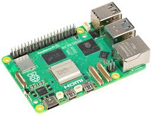

# 4G Calling Application based on Raspberry Pi and SIM7600EI
The SIM7600EI module has a functionality for audio calls. Once the call is placed, the module plays the text the user has sent using AT Commands by converting it to speech (TTS). However, this is not suitable in cases where users speak different languages. This system allows the user to directly play a user configured MP3 audio file over call allowing flexibility of languages and accents.

  

## Components:
- Flask App: Receives requests from the client side and GPIO and handles calling and text messages and additionally monitors the network and SIM card status of the SIM7600EI module over UART, using AT Commands. Since Flask handles one request at a time, it ensures safe communication with the SIM7600EI module by not allowing simultaneous access to the port. The Flask server also plays the audio file using PyGame when the recepient answers the call.
- FastAPI Application: This application hosts the react frontend and handles CRUD operation requests from the client. If a voice call or message request is received, a background task is scheduled that makes HTTP requests to the Flask server with details of the call or text message.

## Setup:
- Ensure you have python on your system
- Navigate to the Flask folder and run "pip install -r requirements.txt" and then "python3 app.py"
- Navigate to the FastAPI folder and run "pip install -r requirements.txt" and "python3 app.py"
- <b>To run this project startup</b>, place the files in services folder in your systems startup services folder which can depend on your OS.